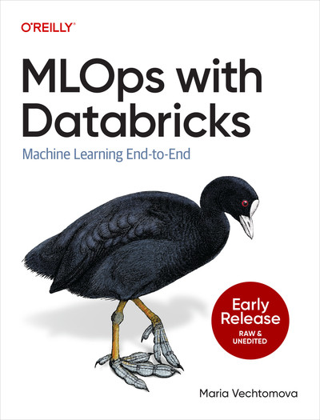

# MLOps with Databricks

<a href="https://learning.oreilly.com/library/view/mlops-with-databricks/9798341608245/">
  
</a>

Code repository accompanying the O'Reilly [*MLOps with Databricks: Machine Learning End-to-End*](https://learning.oreilly.com/library/view/mlops-with-databricks/9798341608245/) book by Maria Vechtomova.

## Repository Structure

This repository is organised into two self-contained projects, one per part of the book:

---

### [mlops/](mlops/)

Covers **Chapters 2-6** of the book. Demonstrates a complete ML lifecycle for a hotel booking price prediction use case, built on LightGBM, MLflow, Unity Catalog, and Databricks Asset Bundles.

| Chapter | Topic |
|---------|-------|
| 2 | Developing on Databricks — data preprocessing |
| 3 | Experiment tracking in MLflow, model training, logging, and registration in Unity Catalog |
| 4 | Model serving, feature serving, and endpoint authentication |
| 5 | CI/CD with Databricks Asset Bundles |
| 6 | Lakehouse monitoring |

---

### [llmops/](llmops/)

Covers **Chapter 7** of the book. Demonstrates LLMOps patterns on Databricks, including building, evaluating, and deploying an LLM-powered agent.

| Chapter | Topic |
|---------|-------|
| 7 | LLMOps — vector search, Genie, MLflow tracing, agent evaluation, and agent deployment |

---

## Getting Started

Each project uses **Python 3.12** with **uv** for dependency management. See the `README.md` inside each folder for setup instructions and environment-specific details.

```bash
# MLOps project (Chapters 2–6)
cd mlops
uv sync --extra dev

# LLMOps project (Chapter 7)
cd llmops
uv sync --extra dev
```
